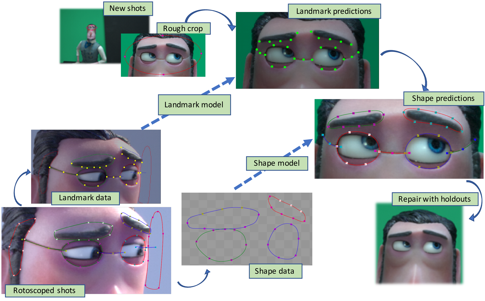

# Dataset for A Learning-Based Approach to Parametric Rotoscoping of Multi-Shape Systems, WACV 2021

## Licenses
PLEASE NOTE: There are two licenses in this project.

The first is a license for the image and video files from Laika, LLC. The text for this license is in [LICENSE-Image_and_video_files.txt](LICENSE-Image_and_video_files.txt).

The second is a license for the JSON files from Intel Corporation. That license is in [LICENSE-JSON_files.txt](LICENSE-JSON_files.txt).

Please read and understand both licenses before use.
